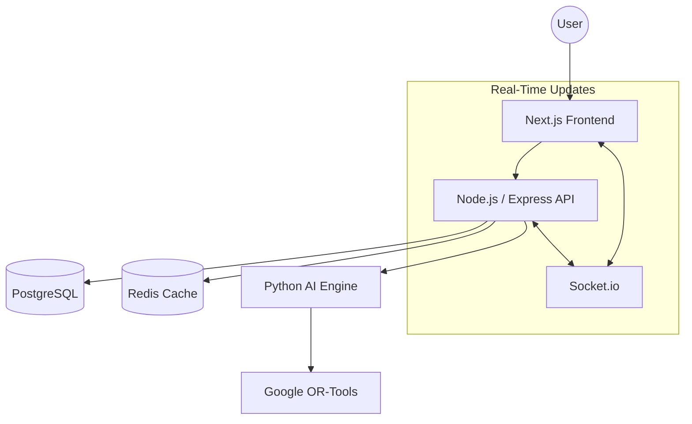

# Zembaa.AI Scheduler (Timetable Management Platform)

[](https://opensource.org/licenses/MIT)
[](https://pnpm.io/)
[](https://developers.google.com/optimization)

**Zembaa.AI Scheduler** is a high-performance, AI-driven academic scheduling platform designed for large-scale universities. It automates the complex task of generating conflict-free, workload-balanced timetables while adhering to **NEP 2020** mandates.

---

## Key Enterprise Features

- **Robust Firebase Auth Synchronization**: Fully automated, two-way sync between PostgreSQL and Firebase Authentication for all CRUD user operations (Super Admins, University Admins, Department Admins, and Faculty). Ensures no orphaned users and tight login integrity.
- **Enterprise Activity Logging**: Dual-storage (Database + Filesystem) asynchronous activity monitoring. Critical mutations automatically track execution timestamps, explicit changes, IP Addresses, and Device Headers using extreme high-throughput pipelines. 
- **Graceful Deletion Safeguards**: Highly descriptive, user-friendly dependency trapping blocks the deletion of core entities (like Departments or Universities) if they harbor orphaned records like active courses, batches, timetables, or faculty.
- **High-Performance Architecture**: Next.js App Router wrapped in Turbopack for ultra-fast compilation, Brotli-compressed Express.js REST APIs caching heavy responses through an integrated Redis Layer.

---

## System Architecture

The project is structured as a **Polyglot Monorepo**, isolating concerns while maintaining strong type safety across the stack.



### Microservices Breakdown
| Service | Tech Stack | Responsibility |
| :--- | :--- | :--- |
| **`apps/web`** | Next.js 14, Tailwind, Shadcn | Multi-role responsive dashboard (4 Panels). |
| **`apps/api`** | Node.js, TypeScript, Prisma | Business logic, RBAC, Firebase integrations and AI orchestration. |
| **`apps/ai-engine`**| Python 3.10, FastAPI | Constraint solving and optimization logic using OR-Tools. |
| **`packages/types`** | TypeScript | Shared Zod schemas and TypeScript interfaces. |

---

## The AI Scheduling Engine

The "brain" of the platform uses **Google OR-Tools CP-SAT Solver** to resolve billions of possible scheduling combinations in seconds.

### Constraints & Optimizations
- **Hard Constraints**: Faculty separation (no clones), un-overlappable room assignments, batch integrity, and strict capacity checks. 
- **Soft Constraints**: Heavy workload balancing, minimized slot gaps, preferred daily slot prioritization.

---

## Feature Matrix

The platform is divided into 4 specialised panels to handle the university hierarchy:

### 1. Global Superadmin
- Managing multiple university tenants and configuring platform-wide settings.
- Security oversight natively backed by Enterprise Audit Logging.

### 2. University Admin
- Full infrastructure management (Classrooms, Labs, Departments).
- Faculty pool coordination and primary/secondary workload assignment.

### 3. Department Admin
- Granular control over department-specific courses and batches.
- **Standard Generation**: AI-triggered master schedules.
- **Special Contingency**: Regenerate schedules on-the-fly when faculty are absent.

### 4. Faculty Portal
- Personalised weekly schedule view.
- Real-time updates on room changes or substitutions.

---

## Step-by-Step Project Start

Follow these exact steps to launch the entire ecosystem in under 2 minutes:

### 1. External Infrastructure (Docker)
Ensure Docker is running, then spin up the database, cache, and solvers:
```bash
docker-compose up -d
```

### 2. Backend & Database Sync
Initialise the database schema and seed the environment with VNSGU demo data:
```bash
cd apps/api
pnpm install
npx prisma db push
npx prisma db seed # This creates demo accounts!
# Start the API
pnpm run dev
```

### 3. Solvers & Health Check
The AI engine and Redis start automatically with Docker. You can check the solver health at `http://localhost:5000/health`.

### 4. Frontend Launch
In a new terminal:
```bash
cd apps/web
pnpm install
pnpm run dev
```
Open `http://localhost:3000` and log in.

---

## Demo Credentials

| Role | Email | Password |
| :--- | :--- | :--- |
| **Superadmin** | `superadmin` | `password123` |
| **Uni Admin** | `admin_vnsgu` | `password123` |
| **Dept Admin** | `admin_dcs_vnsgu` | `password123` |
| **Faculty (Ravi)** | `ravi` | `password123` |

---

## Deployment

This project is optimised for **Google Cloud Platform (GCP)** using:
- **Cloud Run** for horizontal scaling of microservices.
- **Cloud SQL** for managed PostgreSQL.
- **Memorystore** for managed Redis.

See the [In-depth GCP Deployment Guide](./gcp_deployment_guide.md) for step-by-step instructions.

---

## License
Distributed under the MIT License. See `LICENSE` for more information.

*Built By [Rajput Shivam Singh](https://github.com/WhiteDevil-rss)*